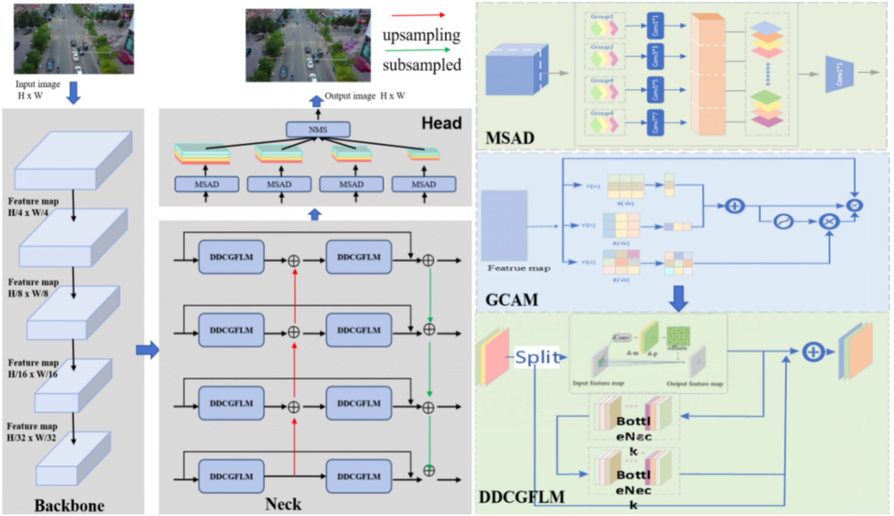

# DDC-Net
Scale-aware deformable feature alignment network for robust small-object detection in UAV imagery.
# 🚀 DDC-Net: Scale-Aware Deformable Feature Alignment for Robust Small-Object Detection in UAV Imagery

[-blue)](#)
[]()
[]()
[]()

This is the official PyTorch implementation of **DDC-Net**. 

> **Scale-Aware Deformable Feature Alignment for Robust Small-Object Detection in UAV Imagery**<br>
> Ruofan Zeng, Fen Xiao, Xiang Li, Jingwen Cai, Xieping Gao<br>
> *Under Review at The Visual Computer*

## 📢 Updates
- **[2026.06]** 🚀 Code and pre-trained weights for VisDrone2021 and UAVDT datasets are released!
- **[2026.06]** 📄 The manuscript has been revised and resubmitted to *The Visual Computer*.

---

## 💡 Introduction

[span_3](start_span)Unmanned aerial vehicle (UAV) imagery presents persistent challenges for object detection because targets are often small, densely distributed, partially occluded, and embedded in cluttered backgrounds[span_3](end_span). [span_4](start_span)We propose **DDC-Net**, a scale-aware deformable feature-alignment framework[span_4](end_span)[span_5](start_span), which formulates UAV detection into three coupled feature-level problems: weak feature magnitude degradation, background-induced sampling drift, and scale-inconsistent prediction[span_5](end_span). 

### Architecture
<div align="center">
  
</div>

[span_6](start_span)DDC-Net integrates three core components[span_6](end_span):
1. **BHFP** (Bidirectional Hierarchical Feature Pyramid) to preserve small-object details.
2. **DDCGFLM** (Dynamic Deformable Convolution-Guided Feature Learning Module) to suppress background drift via coordinate attention.
3. **MSAD** (Multi-Scale Aware Detection Head) to adaptively reallocate receptive fields for severe scale variations.

---

## 📊 Model Zoo (VisDrone2021-val)

[span_7](start_span)[span_8](start_span)All models are evaluated on a single NVIDIA L20 GPU with an input resolution of 640x640[span_7](end_span)[span_8](end_span).

| Model | Resolution | AP | AP₅₀ | AP₇₅ | Params (M) | GFLOPs | FPS | Weights |
|:---|:---:|:---:|:---:|:---:|:---:|:---:|:---:|:---:|
| YOLOv8l | 640x640 | 27.5 | - | - | 43.6 | 165.4 | 193.60 | - |
| **DDC-Net (Ours)** | 640x640 | **34.4** | **52.8** | **33.7** | **38.7** | **322.2** | **65.09** | [Download](#) |
| **DDC-Net (Ours)** | 1024x1024 | **40.0** | **60.4** | **40.2** | **38.7** | - | - | [Download](#) |

*For more detailed category-level results (Pedestrian, Bicycle, Tricycle, Awning-tricycle), please refer to our paper.*

---

## 🛠️ Installation

**1. Create a conda environment and activate it:**
```bash
conda create -n ddcnet python=3.8 -y
conda activate ddcnet